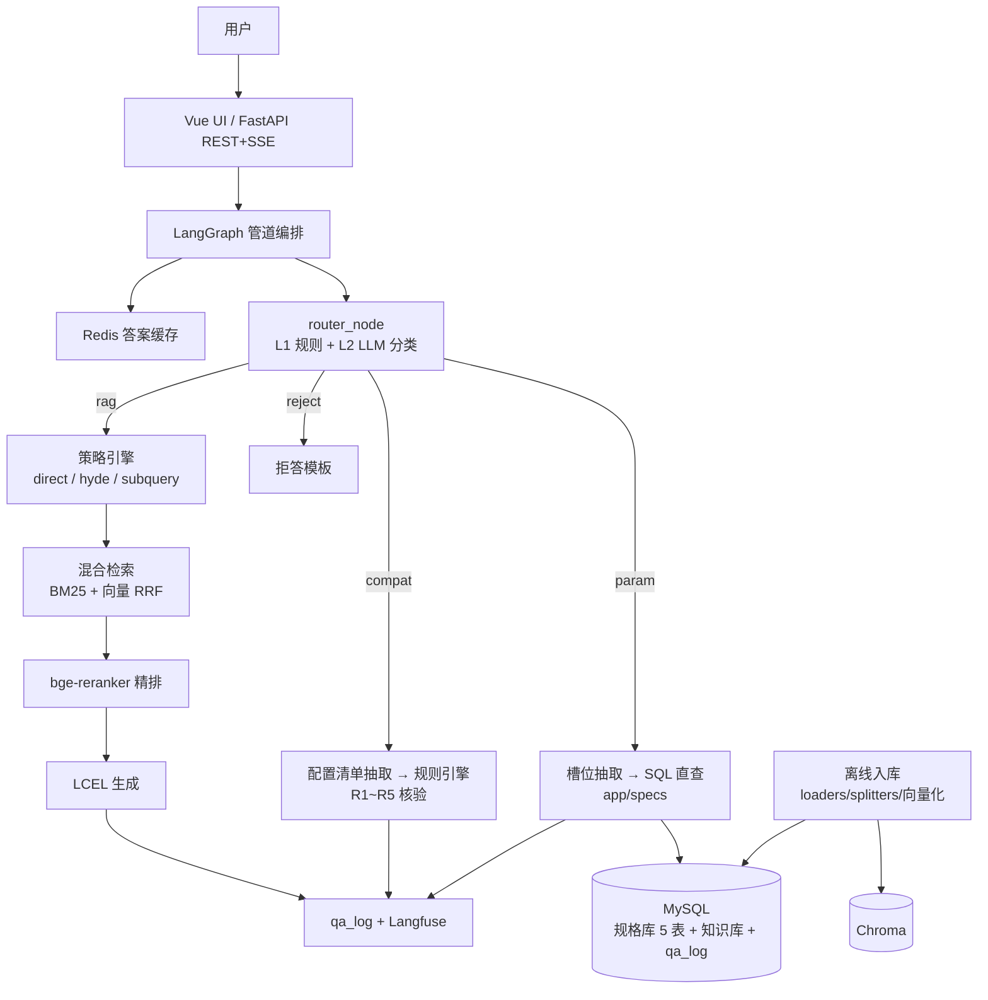

# 装机参谋 BuildSage

基于 **LangChain 1.x + LangGraph** 的**结构化 + 非结构化混合 RAG 系统**：规格参数直查（秒级精确卡片）、装机兼容性规则校验（逐条核验单）、选购攻略深度问答（混合检索 + 重排 + 引用溯源），RAGAS 评估 + Langfuse 全链路追踪。

> 面向 DIY 装机场景：电脑硬件参数是**可查证的事实**（适合结构化直查而非向量检索），装机配置是**多约束联合校验**（适合规则引擎而非 LLM 自由发挥），选购决策是**开放问题**（适合 RAG 深度回答）——三类问题分流到三条最优链路，正是本项目的架构核心。

## 功能特性

- **四通道 LangGraph 管道**：`param 参数直查` / `compat 兼容校验` / `rag 深度问答` / `reject 拒答`，路由层 L1 规则词 + L2 LLM 结构化分类
- **结构化参数直查**：LLM 槽位抽取（with_structured_output）→ 参数化 SQL 查规格库 → 精确参数卡片（不经过向量检索，准确率可验证）
- **兼容性规则引擎**：插槽匹配 / 内存代数 / 功耗预算 / 显卡长度 / PCIe 世代五类规则（R1~R5），纯 Python 实现、逐条引用规则 id，LLM 只负责把自然语言配置抽取成结构化清单
- **混合检索 + 重排**：BM25 + 向量召回，EnsembleRetriever（RRF 融合）→ bge-reranker-large 精排（ContextualCompressionRetriever）
- **检索策略引擎**：direct / HyDE（假设文档）/ subquery（多子查询，MultiQueryRetriever）
- **三级缓存**：Redis 答案缓存 + 会话历史 + 并发锁，MySQL 规格库兜底
- **多轮对话 + 流式输出**：会话历史改写、SSE 逐 token 输出、引用溯源
- **可复现评估**：参数直查准确率 / 兼容判定 F1（金标从规格库自动生成）+ RAGAS 三指标（攻略问答链路），见 `EVALUATION.md`
- **全链路可观测**：Langfuse 自托管，每条问答的路由依据 / SQL / 检索分数 / token 耗时完整 trace

## 总体架构



## 技术栈

| 组件 | 选型 | 说明 |
|---|---|---|
| 编排 | LangChain 1.x + LangGraph | 经典检索组件（langchain-classic）+ 确定性管道（StateGraph） |
| LLM | DeepSeek（langchain-openai） | OpenAI 兼容接口，结构化输出用 with_structured_output |
| Embedding | BAAI/bge-m3（langchain-huggingface） | 1024 维，normalize |
| 重排 | BAAI/bge-reranker-large | CrossEncoderReranker + ContextualCompressionRetriever |
| 向量库 | Chroma（langchain-chroma） | 开发期；schema 与 Milvus 对齐可平滑切换 |
| 混合检索 | BM25Retriever + EnsembleRetriever | RRF 融合，不依赖原始分数量纲 |
| 规格库 | MySQL 8.0（SQLAlchemy） | cpu / gpu / motherboard / memory / psu 五表 |
| 缓存 | Redis 7 | 答案缓存 / 会话历史 / 并发锁 |
| 评估 | RAGAS + 自研硬指标 | 参数准确率、兼容判定 F1 金标自动生成 |
| 可观测 | Langfuse（自托管） | docker-compose 一键拉起 |
| 服务 | FastAPI（REST + SSE）· Vue 3 + Element Plus | 前后端分离 |

## 快速开始

```bash
# 0. 安装依赖（Python 3.10+）
pip install -r requirements.txt

# 1. 拉起 MySQL / Redis（/ Langfuse）
docker compose up -d

# 2. 配置环境变量
cp .env.example .env   # 填入 DEEPSEEK_API_KEY，缺省自动降级 Mock

# 3. 建表 + 规格库导入（CPU/GPU 从公开规格页抽取，主板/内存/电源为整理数据）
python scripts/extract_specs.py
python scripts/load_specs.py

# 4. 攻略语料入库
python scripts/ingest_guides.py

# 5. 启动服务
uvicorn app.api.main:app --host 127.0.0.1 --port 8000
cd frontend && npm install && npm run dev
```

## 里程碑

| 阶段 | 内容 |
|---|---|
| P0 | 项目初始化（EduRAG 骨架迁移 + 教育域清理 + LangChain 栈依赖） |
| P1 | 规格库：公开规格页抽取 + 兼容规则引擎 R1~R5 + 建表入库 |
| P2 | LangChain 入库链路 + 自写选购攻略语料 |
| P3 | 混合检索 + 重排 + LCEL 生成 + SSE |
| P4 | 四通道路由 + 参数直查 + 兼容校验（LangGraph 管道） |
| P5 | 评估（RAGAS + 参数准确率 / 兼容 F1）+ Langfuse 可观测 |
| P6 | 前端换皮 + 交付文档（README / INTERVIEW / EVALUATION / SOURCES） |

## 语料与数据来源

- **结构化规格**：CPU/GPU 抽取自 Wikipedia 公开规格列表（CC BY-SA，`scripts/extract_specs.py`）与 PassMark 性能榜（仅本地参考，原始页面不入仓库）；主板/内存/电源为人工整理（来源为厂商公开规格页，见 `data/SOURCES.md`）
- **非结构化攻略**：自写通用选购指南（`data/docs/`），不包含第三方受版权保护内容
- 原始抓取页面（`data/docs/*.html`）不提交至仓库，仓库仅保留抽取产物 JSON
