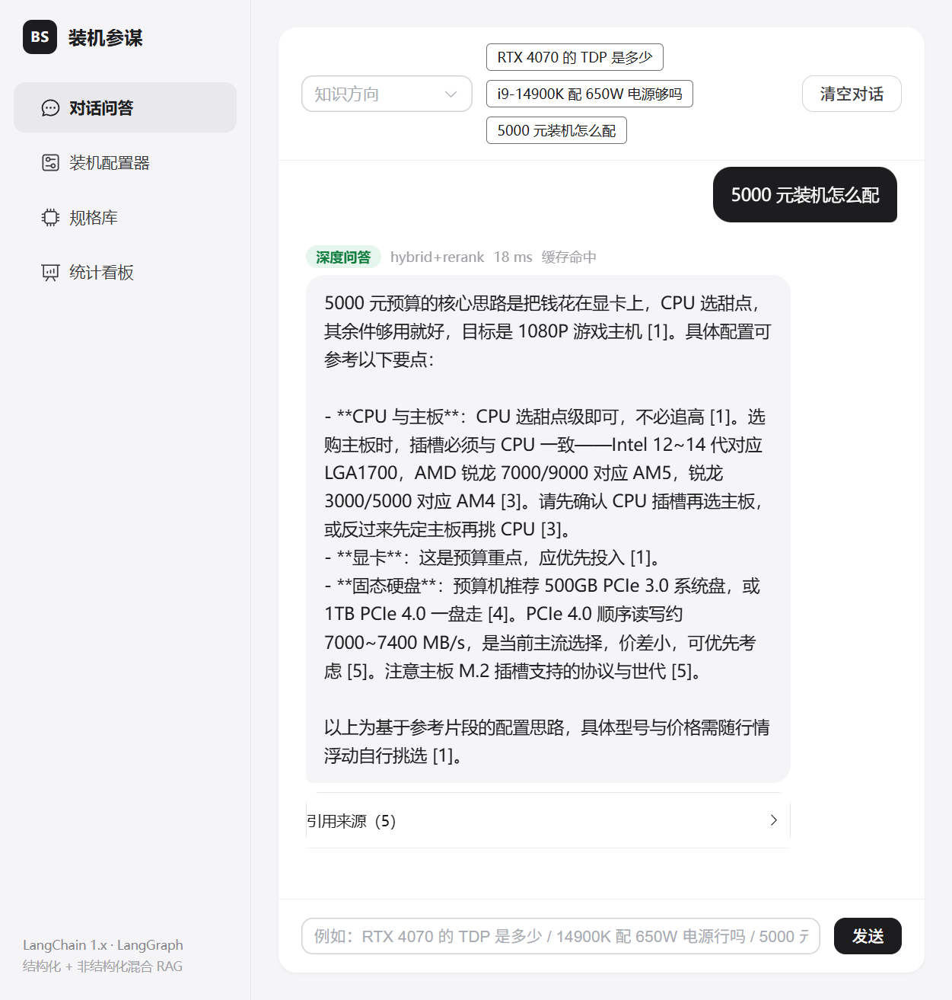
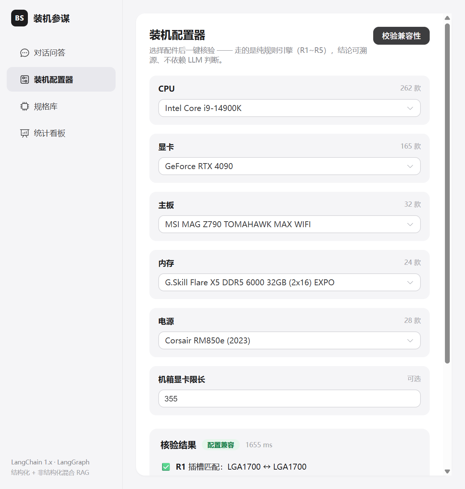
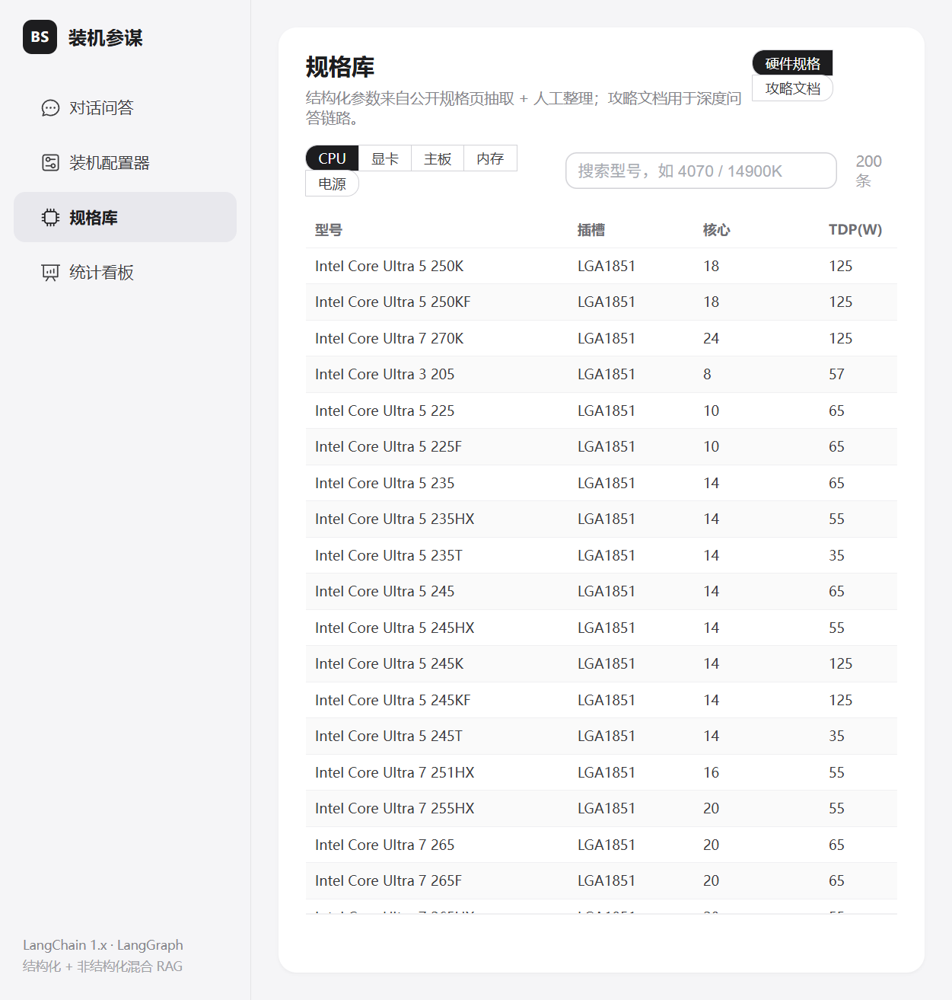
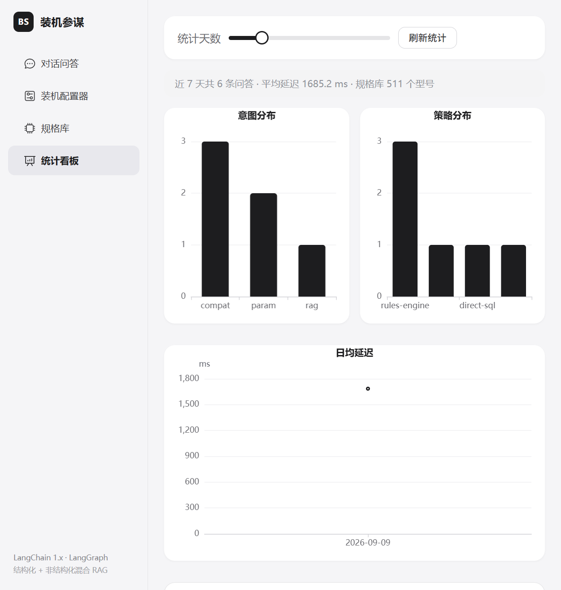

# 装机参谋 BuildSage

一个面向 DIY 装机知识的 **纯 RAG 智能问答系统**。
后端 FastAPI + LangChain/LangGraph，前端 Vue 3，规格数据从公开规格页抽取，攻略文档自写。



## 为什么做这个

硬件参数、选购建议和装机知识统一作为知识库内容参与检索。系统经过相关性判断后，统一进入“策略选择 → 多 query 检索 → 重排 → 生成”的 RAG 链路；无关问题在入口拒答。

## 效果

**对话页**——每条回答都经过统一 RAG 链路，流式输出答案并展示引用溯源。



装机配置器是不打字也能用的独立工具：下拉选件 → 点校验 → 出核验单，不影响聊天页的 RAG 主链路。



规格库共 565 个型号（CPU 265 / GPU 165 / 主板 32 / 内存 24 / 电源 28 / 散热器 25 / 机箱 29），可搜索、按类别浏览，来源标注了是"公开规格页抽取"还是"人工整理"。



统计看板从 `qa_log` 聚合意图分布、策略分布、延迟和热点问题。

## 架构

```
用户问题
   │
   ├─ Redis 答案缓存命中 ──────────────── 直接返回
   │
   ├─ router_node（规则 + LLM 相关性判断）
   │     ├─ rag     → 策略选择 → 多 query 混合检索 → 重排 → 生成
   │     └─ reject  → 拒答模板
   │
   └─ 写回缓存 + qa_log 落库
```

用 LangGraph 编排的是**确定性 RAG 管道**（每个节点单一职责、无循环），策略引擎只负责选择检索方式，不开放工具调用，便于控制延迟和幻觉。

**兼容规则**（`app/specs/rules.py`，纯 Python 可单测）：

| 规则 | 内容 |
|---|---|
| R1 | CPU 插槽 ↔ 主板插槽 |
| R2 | 内存代数 ↔ 主板/CPU 支持（数据缺失时按 AM4/AM5 等插槽平台规则兜底） |
| R3 | CPU 最大功耗 + GPU TDP + 80W 余量 ≤ 电源额定 |
| R4 | 显卡长度 ↔ 机箱显卡限长（机箱库自动取，手填兜底） |
| R5 | PCIe 世代向下兼容提示 |
| R6 | 散热器解热能力 ≥ CPU 最大睿频功耗 |
| R7 | 散热器支持插槽 ↔ CPU 插槽（兼容 LGA17XX 等通配写法） |
| R8 | 水冷冷排尺寸 ↔ 机箱最大冷排位 |
| R9 | 主板板型 ≤ 机箱支持板型 |

## 技术栈

| 组件 | 选型 |
|---|---|
| 编排 | LangChain 1.x + LangGraph |
| LLM | DeepSeek（langchain-openai，结构化输出走 function calling） |
| Embedding | BAAI/bge-m3（langchain-huggingface） |
| 重排 | BAAI/bge-reranker-large（CrossEncoderReranker） |
| 向量库 | Chroma（langchain-chroma） |
| 混合检索 | BM25Retriever + 向量 → EnsembleRetriever（RRF） |
| 规格库 | MySQL 8（cpu / gpu / motherboard / memory / psu / cooler / pc_case 七表） |
| 缓存 | Redis（答案缓存 / 会话历史 / 并发锁） |
| 评估 | RAGAS + 自研硬指标 |
| 可观测 | Langfuse（可选，不配 key 自动降级） |
| 服务 | FastAPI（REST + SSE）· Vue 3 + Element Plus + ECharts |

## 快速开始

```bash
# 依赖
pip install -r requirements.txt

# MySQL + Redis
docker compose up -d

# 配置（填 DEEPSEEK_API_KEY，不填会降级成 Fake LLM）
cp .env.example .env

# 建表 + 导入规格库
python scripts/init_db.py
python scripts/extract_specs.py      # 可选，产物已随仓库提供
python scripts/load_specs.py

# 攻略语料入库（首次会下载 BGE-M3 权重）
python scripts/ingest_guides.py --rebuild  # 攻略 + 硬件规格统一入库 RAG

# 启动
uvicorn app.api.main:app --host 127.0.0.1 --port 8000
cd frontend && npm install && npm run dev
```

前端 http://127.0.0.1:5173 ，接口文档 http://127.0.0.1:8000/docs 。

## 评估

金标集由 `scripts/gen_eval_set.py --seed 42` 生成并固定随机种子，可复现。RAG 题目标注应命中文档和回答关键点，分别统计路由、检索、回答质量、拒答与配置器兼容性指标。

| 指标 | 结果 |
|---|---|
| 路由分流正确率 | 100%（103/103） |
| RAG 回答关键点准确率 | 由 `scripts/evaluate.py` 按金标 `answer_keys` 统计 |
| Recall@5 | 由 `scripts/evaluate.py` 按引用文档统计 |
| RAGAS | faithfulness 0.82 / answer relevancy 0.94 / context utilization 0.66 |
| 延迟 p50 | RAG 受本地 embedding / reranker 影响 |

完整报告见 [EVALUATION.md](EVALUATION.md)，复现命令在里面。RAG 延迟主要来自 CPU 上的 embedding 与重排，优化方向写在 [INTERVIEW.md](INTERVIEW.md) 里。

```bash
python -m pytest tests/ -q      # 52 项单测
```

## 目录结构

```
app/
  api/           FastAPI 服务（REST + SSE）
  config.py      配置（pydantic-settings）
  db/            MySQL / Redis 客户端与仓储
  ingest/        LangChain 入库管线（loaders → splitters → 向量化）
  llm/           ChatOpenAI 封装（DeepSeek）
  observability/ Langfuse 追踪
  rag/           路由 / 策略 / 检索 / 重排 / 生成 / 缓存 / 会话 / LangGraph 管道
  rerank/        bge-reranker 适配器
  specs/         规格库仓储 / 槽位抽取 / 兼容规则引擎
frontend/        Vue 3 前端（对话 / 配置器 / 规格库 / 看板）
scripts/         抽取 / 建库 / 导库 / 入库 / 评估
tests/           单元测试
data/
  specs/         规格数据（JSON，MySQL 配置器与 RAG 文档入库源）
  docs/          选购攻略（自写）
  eval/          金标集
  SOURCES.md     数据来源与许可
```

## 数据来源

- **规格数据**：CPU/GPU 从 Wikipedia 公开规格列表抽取（CC BY-SA），PassMark 榜单补性能分；主板/内存/电源人工整理。抓取页面的原始 HTML 不入仓库，只保留抽取产物 JSON。
- **攻略文档**：14 篇自写选购指南，不含第三方版权内容。

详见 [data/SOURCES.md](data/SOURCES.md)。

## 已知限制

- CPU 数据里有少数型号插槽缺失，兼容校验时对应规则会返回"无法校验"而不是误报冲突。
- 显卡长度字段大部分没收录，R4 规则通常跳过，需要手动填机箱限长才能生效。
- 重排在 CPU 上较慢，是当前延迟的主要来源；生产环境需要 GPU 或换更小的模型。
- 价格数据是抓取时的快照，会随行情变化。
